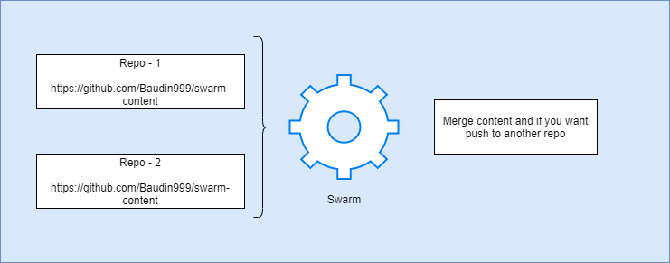

# How to write a blog engine


I've always wondered why content was always entered into a blog engine like Wordpress or medium.com. I've 
always enjoyed writing with tools like LaTeX or Markdown. Anothing thing which always amazed me was how
easilly someone distanced themselves from their content. 

These little amazements have led to me wanting to write a content engine for a very long time and finally
I've had some time to write one. The tool is called `swarm` and is an open-source tool which is created
with the following attributes in mind:

 * 100% cookieless (unless you choose to log in...)
 * A static as possible. Except for a few interations (like posting comments) eveything should be generated
   as simple and static HTML.
 * Hosted with near $0 costs.
 * Lean against edge-computing
 * Have a dark theme to [save energy](https://www.howtogeek.com/407860/heres-when-a-dark-theme-can-save-battery-power/).


First thing to decide is how to work with the content. I want everyone to remain owner of their content.
Luckaly I did not have to think hard but we already have things like GitHub and GitLab which can do this job.

Within `swarm` you can pull content from multiple repo's and merge them into one output repo:



I decided to use the git standard cli tooling and call that from a nodejs application:

```js
import cmd from 'node-cmd';

function cloneRepo(contentDir, source) {
    let tempDir = `....a temp dir...`;
    let cloneDir = `....a temp dir...`;
    return new Promise((resolve, reject) => {
            cmd.run(`cd ${cloneDir} && git clone ${source}`, () => {
                fsExtra.copy(tempDir, contentDir, () => {
                    console.log(`Successfully cloned ${source} to ${contentDir}`);
                resolve();
            });
        });
    });
}
```

All the parameters are supplied either by the directory in which the tool is used or by adding them
to the `swarm.config.json`.


## Getting the meta-data

The meta-data is pulled form the content itself. This can be done through either the `info.json` files in the 
content directory or form the front-matter info in the actual blogpost. For example, this post has the following 
front-matter and no `info.json`:

```yml
author: Carlos Kelkboom
description: 
    Writing a blog engine is something I've always wanted to 
    do. In this blog-post I will go over the ideas I've 
    managed to put into this new engine called 'swarm'.
tags: 
    - Craftsmanship
date: 12-04-2022
```

This is some math:

$$\begin{array}{c}

\nabla \times \vec{\mathbf{B}} -\, \frac1c\, \frac{\partial\vec{\mathbf{E}}}{\partial t} &
= \frac{4\pi}{c}\vec{\mathbf{j}}    \nabla \cdot \vec{\mathbf{E}} & = 4 \pi \rho \\

\nabla \times \vec{\mathbf{E}}\, +\, \frac1c\, \frac{\partial\vec{\mathbf{B}}}{\partial t} & = \vec{\mathbf{0}} \\

\nabla \cdot \vec{\mathbf{B}} & = 0

\end{array}$$

